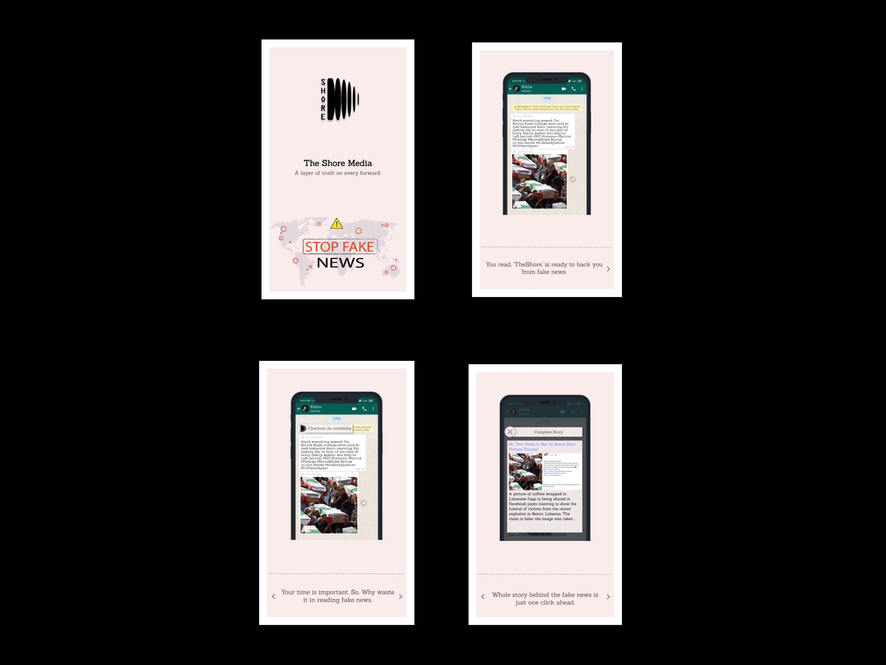

<!-- PROJECT LOGO -->
 

  

  <h3 align="center">The Shore Media</h3>

  

    A layer of truth on every forward.
     
    <a href="https://github.com/nitink133/The-Shore-Media"><strong>Explore the docs »</strong></a>
     
     
    <a href="https://www.dropbox.com/s/k6tncbxivd5t9ot/VID-20200823-WA0000.mp4?dl=0">View Demo</a>
    ·
    <a href="https://github.com/nitink133/The-Shore-Media/issues">Report Bug</a>
    ·
    <a href="https://github.com/nitink133/The-Shore-Media/issues">Request Feature</a>
  

<!-- ABOUT THE PROJECT -->
## About The Project

Shore is a real-time fake news detection application for WhatsApp that uses the accessibility services of Android to help users avoid spreading misinformation. The app uses a Python script to verify the sources of messages received on WhatsApp with an international fact-checking network. This allows Shore to accurately determine if a message contains fake news or not. If a message is found to be fake, the app will alert the user and provide them with information on why the news is considered false. This can help users protect themselves from being deceived by fake news and prevent the spread of misinformation on WhatsApp. 

The app works in real-time, so it can detect fake news as soon as it is received on the platform. This makes Shore an effective tool for staying informed and avoiding the spread of fake news on WhatsApp.

